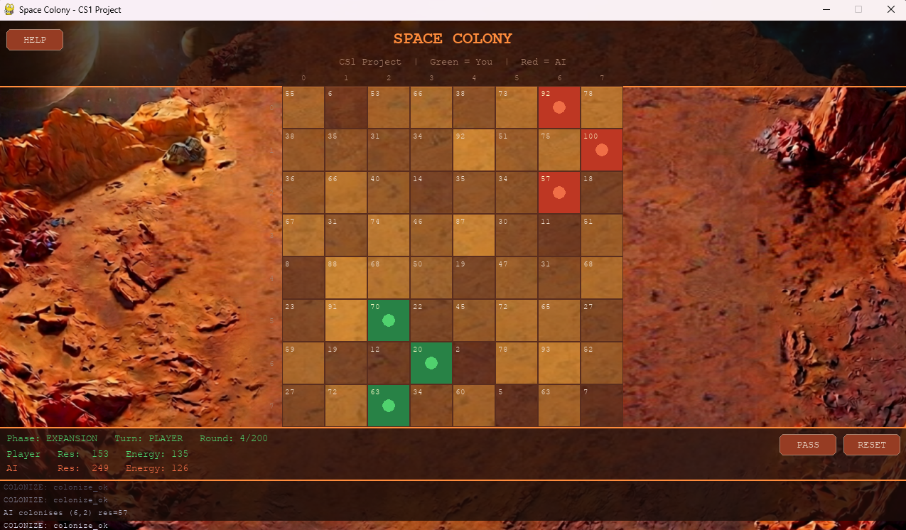

# Space Colony — CS1 Project

**Team:** Laura Paez · Nicolás Acero · Erik Fernandez
**Variant:** Space Colony (No. 14)
**Course:** Computer Science I — Universidad Distrital Francisco José de Caldas
**Semester:** 2026-I

Space Colony is a turn-based strategy game where a human player (green) competes
against an AI opponent (red) to dominate an 8×8 grid planet. The AI uses **greedy**
and **backtracking** algorithms. The C++ engine implements a **linked list** and an
**AVL tree** from scratch. Python (Pygame) handles the UI and AI logic, communicating
with the engine exclusively through JSON files.

---

## How the Game Looks





---

## Project Structure

```
project/
├── compile.bat              Windows build script (run once)
├── README.md
├── GUIDE.docx               Full game guide for the team
├── engine/                  C++ core
│   ├── json.hpp             nlohmann/json library (already included)
│   ├── linked_list.h/.cpp   Colony history (singly linked list)
│   ├── tree.h/.cpp          Resource depot (AVL tree)
│   ├── main.cpp             Engine: reads input.json -> writes state.json
│   └── Makefile             Build script for Linux/macOS
├── game/
│   ├── algorithms/
│   │   ├── greedy.py        Greedy expansion + attack
│   │   └── backtracking.py  Backtracking expansion planner
│   └── ui/
│       ├── main.py          Pygame interface (ENTRY POINT)
│       ├── bridge.py        JSON I/O bridge (Python <-> C++)
│       └── assets/          Put your background image here (background.png)
└── data/
    ├── input.json           Python -> C++
    └── state.json           C++ -> Python
```

---

## Requirements

- Python 3.10+
- pygame: `pip install pygame`
- g++ (C++17 compiler)

### Installing g++

**Windows**
1. Install MSYS2 from https://www.msys2.org
2. In the MSYS2 UCRT64 terminal: `pacman -S mingw-w64-ucrt-x86_64-gcc`
3. Add `C:\msys64\ucrt64\bin` to your Windows PATH
4. Reopen the terminal and verify: `g++ --version`

**Linux:** `sudo apt install g++`
**macOS:** `xcode-select --install`

---

## How to Run

### 1. Compile the C++ engine (once)

**Windows** (from the project root):
```
.\compile.bat
```

**Linux / macOS**:
```bash
cd engine && make && cd ..
```

### 2. Run the game

```bash
# Windows
py game\ui\main.py

# Linux / macOS
python3 game/ui/main.py
```

> The Python layer auto-recompiles the engine if the C++ source is newer than
> the binary, so you never run a stale engine after editing the C++ code.

---

## Controls

| Action | Input |
|---|---|
| Colonise a cell (expansion) | Left-click an empty cell |
| Select attack origin (combat) | Left-click your green cell |
| Attack enemy cell (combat) | Left-click an adjacent red cell |
| Pass turn | PASS button |
| Reset game | RESET button or `R` |
| Help | HELP button or `H` |

---

## Architecture

```
Pygame UI  --write-->  input.json  --read-->  C++ Engine
           <--read--   state.json  <--write--
```

Communication between Python and C++ is **exclusively through JSON files** — no
sockets, shared memory, or language bindings.

---

## Algorithms

| Algorithm | File | Phase | Complexity |
|---|---|---|---|
| Greedy Select Move | greedy.py | Expansion | O(n) |
| Greedy Attack | greedy.py | Combat | O(n) |
| Backtracking | backtracking.py | Expansion (AI) | O(4^d), d≤5 |

## Data Structures (C++, implemented from scratch)

| Structure | File | Purpose | Insert | Search |
|---|---|---|---|---|
| Singly Linked List | linked_list.cpp | Colony history | O(1) | O(n) |
| AVL Tree | tree.cpp | Colonies sorted by resources | O(log n) | O(log n) |

---
